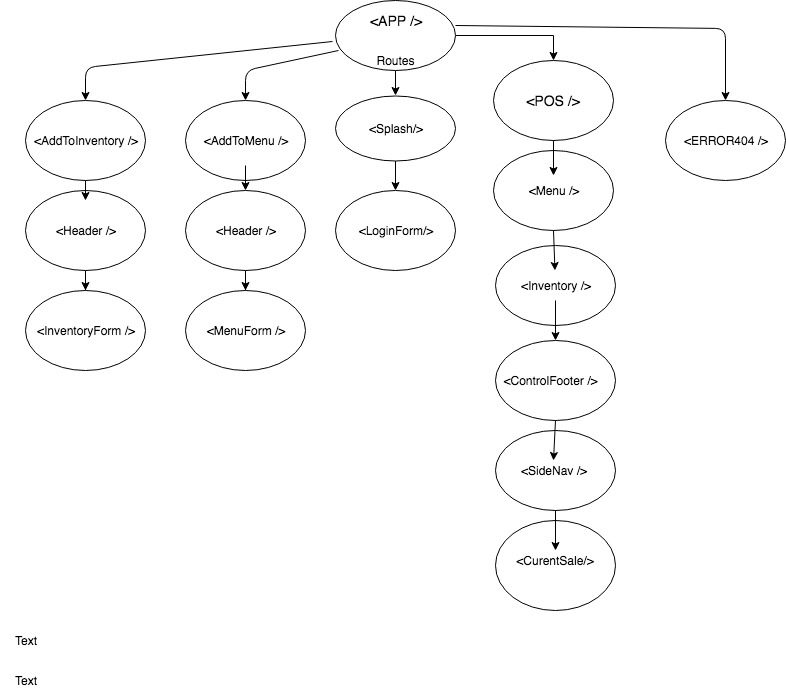

# CoffeeShop App

An Web app allowing users to manage inventory and sales using React.

## Project Proposal

CoffeeShop POS

App will be a POS designed for Coffee Shops. Will have inventory integration to allow users to track their inventory while selling drinks.

Features:

* Login section
* Drink menu
* Inventory list
* Goal: 
To create a complete front end of POS system.

Libary:

* React

Extra Features:

Integrate a C# back-end, that would handle user logins, storing users inventory, and storing drinks.
Allow  for users to accept credit card payments
Email Admin if stock becomes low.

Extra Features will require:

C# 
.Net Core Framework

Once all extra features are added, will transform into mobile app using React-Native.

## Created
Austin Barr

## Installation
(if you do not have node)

```
brew install node
```
```
node -v
v6.2.0
```
```
npm -v
3.10.5
```

1. Clone this repository.


 ```
NPM Install
 ```


2. Run App on local server
  ```
  NPM RUN Start
  ```
   
## Specifications

### Technologies Used

* React
* JS
* HTML
* CSS
* BOOTSTRAP

### Support and Contact Details
If you encounter any bugs or would like to make suggestions regarding this project, please feel free to contact austinbarr@protonmail.com.

### Notes
Planning this project was very time consuming. I was happy I only had one stateful component. I am still getting used to React and believe I just need a good chunk of time to really understand best practices of structuring a React app.

### Component Structure



### License
This project is distributed under the MIT License
